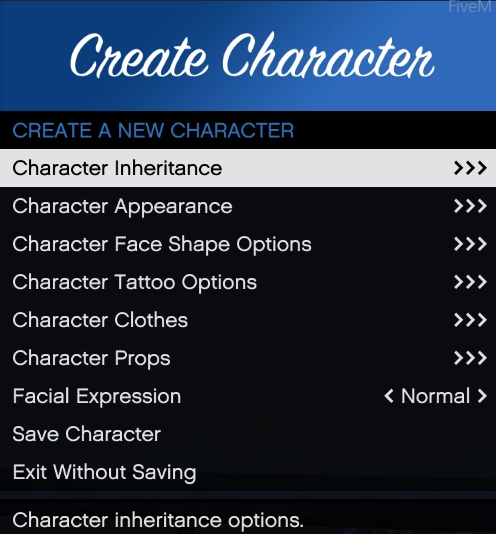
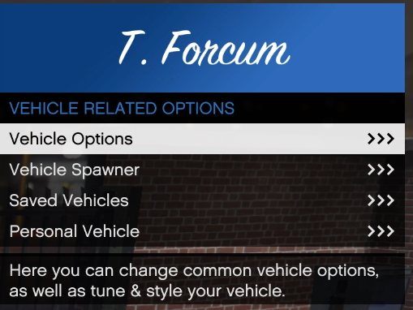

# How to use Vmenu.
We currently use Vmenu for creating players, spawning vehicles, and getting weapons in the server

To open Vmenu press F1 on your keyboard.

You will have the following options for normal users.

| Name | Description |
| ---- | ----------- |
| Online Players | Check to see who is online, TP to other players. |
| Player Related Options | Heal yourself, change your ped, create MP peds, add or remove weapons |
| Vehicle Related options | Spawn Vehicles, edit vehicles |
| Voice Chat Settings | Manage your voice settings |
| Recording Options | make clips while in game to edit later |
| Misc Settings | Vmenu Settings, wear you can save your settings, clear locals from a scene, etc. |

## How to create a player in Vmenu

In order to create a player in Vmenu, you will select mp ped customization in player related options.

Then you will click on either Create Male Character, or Create Female Character.

After selecting the gender of you ped you will then be given the options, to choose appearance, tattoos, clothes, and props.

After creating your character, make sure you save it, it will close after. Make sure you give it a name you will remember. 
!!! tip
    You can only have one character with the same name, if you have more then one of the same ped, with different clothes you will need to add to the name for it to save.

## How to edit a player in Vmenu 

In order to edit a player in Vmenu, you will select mp ped customization in player related options.

Then you will need to click on Saved Peds

Then select the saved ped to edit.

## Spawning weapons in Vmenu

In order to get weapons in Vmenu, you will select weapon options in player related options.

afterwards you may click on spawn by name, or go thought each category and spawn the weapons you would like.

### Saving as a loadout.
to save you weapons in a loadout you will need to click on weapon loadouts in player related options

then you will select save loadout to save the loadout you have. Edit the load out, to edit your saved loadouts

## Spawning vehicles in Vmenu
In order to spawn vehicles in Vmenu, you will need to select vehicle options.

### Vehicle Options

Select vehicle options to edit your paint, liverys, vehicle mods, etc

### Vehicle Spawner

Spawn vehicles by name, categories, etc

### Saved Vehicles

Save vehicles to use for later, spawn saved vehicles.

### Personal Vehicle

Set your personal vehicle, where you can lock the doors, turn the engine on while near the vehicle, etc